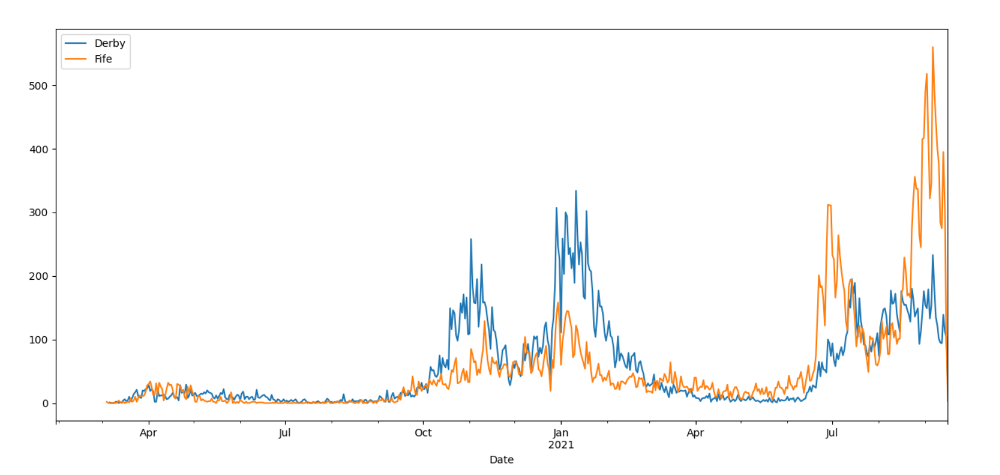

# UK Covid-19 case visulisation

A Python module that aims to aid in the visualisation of the UK COVID-19 case data - Data is obtained from the UK Gov official API.

Developed and tested in Python 3.8

## How do I get set up?

Make sure you have Git installed - [Download Git](https://git-scm.com/downloads)

Install Python - [Download Python](https://www.python.org/downloads/)

* Clone this repository to your local machine
* Install the requirements:

```
>> cd <git-repo-root-dir>
>> pip install -r requirements.txt
```

Check that the installation was successful by running the following command from terminal / command-line in the src directory:


```
python .\covid_case_visualisation.py -h
```

This will print the helper for the command line interface which can be useful for working interactively:

```
usage: covid_case_visualisation.py [-h] [-d] [-r] [-D] [-n region [region ...]] [-a Number] [-N] [-l] [-p] [-j [path]]

This is a command line interface (CLI) for the nhs_covid_data_visualiser module

optional arguments:
  -h, --help            show this help message and exit
  -d, --no-download     Does not attempt to update data.
  -r, --region          Reads region data.
  -D, --delta           Works out the delta cases.
  -n region [region ...]
                        Specify the region(s).
  -a Number             Rolling average.
  -N, --normalise       Normalises the data.
  -l, --list            Lists areas that data is collected in. (default: print data)
  -p, --plot            Plots the data (default: print data).
  -j [path]             outputs the data as a JSON. (default: print data)

Ethan Jones & George Ashmore, 2020-06-30
```

## Usage

| Example command      | Description |
| ----------- | ----------- |
| ```python .\nhs_covid_data_visualiser.py -a 7 -n "Derby"```|Display the COVID-19 data for the Derby region, normalising to a 7-day rolling average, as a Pandas DataFrame.|
| ```python .\nhs_covid_data_visualiser.py -D -n "Derby" ```|Display the delta COVID-19 data for the Derby region as a Pandas DataFrame.|
| ```python .\nhs_covid_data_visualiser.py -l```|Display a list of the regions covered by the UK Gov API.|
| ```python .\nhs_covid_data_visualiser.py -n "Derby" -p```|Plot the COVID-19 data for the Derby region.|
| ```python .\nhs_covid_data_visualiser.py -p -D -n "Derby" "Fife"``` |Plot the delta COVID-19 data for both the Derby and Fife regions.|
| ```python .\nhs_covid_data_visualiser.py -j <path_to_file>``` |Outputs the API response to a json file.|
| ```python .\nhs_covid_data_visualiser.py -p -D -n "Derby" "Fife"``` |Plot the delta COVID-19 data for both the Derby and Fife regions.|
| ```python .\nhs_covid_data_visualiser.py -p -d -D -n "Derby" "Fife"``` |Plot the delta COVID-19 data for both the Derby and Fife regions using the current cached data.|

All commands without the ```-d``` flag will lead to the script checking if the cached API data is outdated and then downloading the new, up-to-date data.

### Example graph



The above graph was generated by running ```python .\nhs_covid_data_visualiser.py -p -D -n "Derby" "Fife"```

## Who to contact
* Ethan Jones <ejones18@sheffield.ac.uk>

## Authors
* George Ashmore & Ethan Jones - *initial work*
